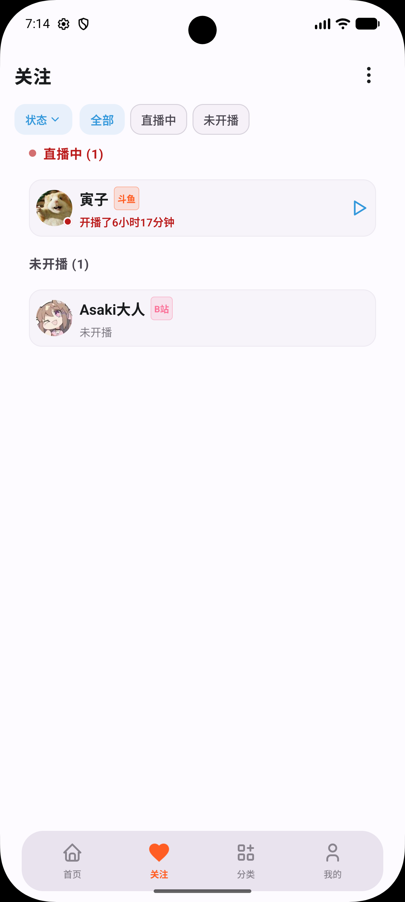
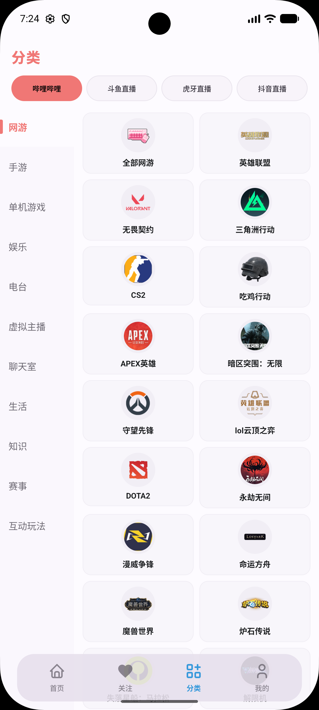
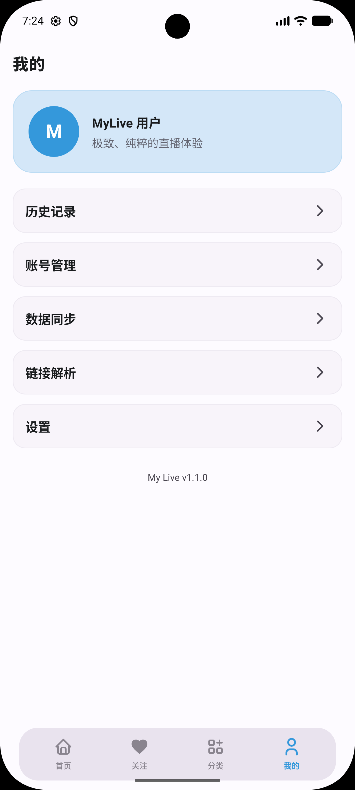
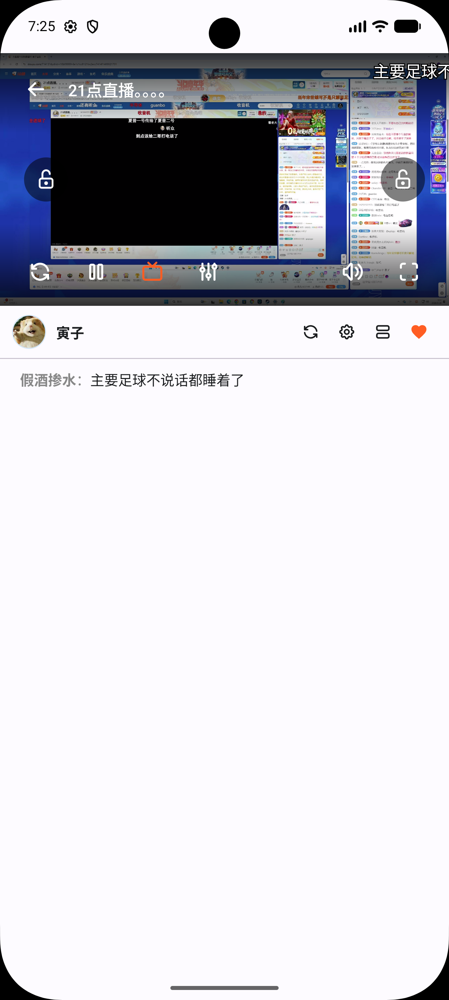
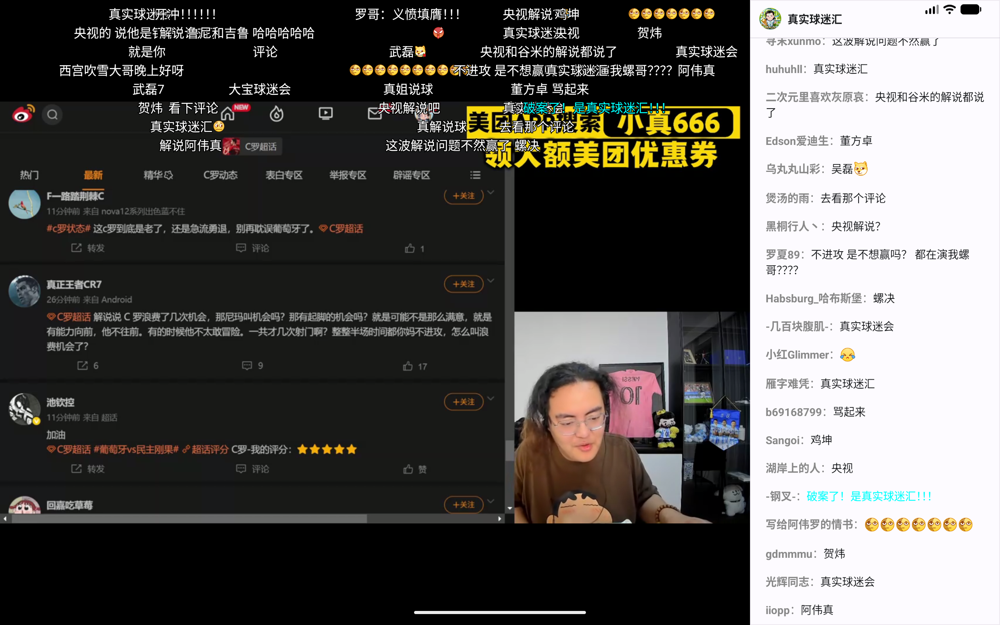
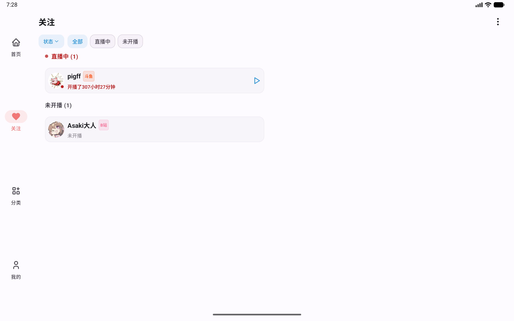
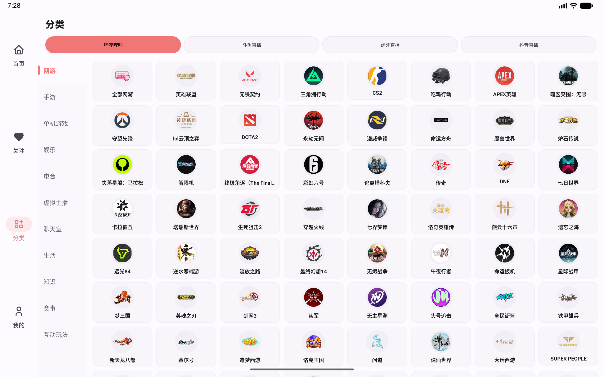

# My Live

纯粹只看直播。

## 项目初衷

本项目源于 MiMo 赠送的 Token 太多用不完（笑），才决定复刻直播客户端 [Simple Live](https://github.com/xiaoyaocz/dart_simple_live)。在此基础上，完全根据个人的审美标准对 UI 界面与操作逻辑进行了重新设计与重构，旨在打造一个更精致、更符合个人使用习惯的直播聚合体验。

当前版本：V1.1.4

## 功能特性

- 支持哔哩哔哩、抖音、斗鱼、虎牙等直播平台。
- 支持直播间浏览、平台分区、直播间搜索和主播搜索。
- 支持直播播放、线路/画质切换、弹幕显示与弹幕快捷设置。
- 支持关注列表、观看历史、直播间快速入口和同类推荐。
- 支持账号 Cookie 登录能力，用于部分平台的登录态功能。
- 支持局域网同步、远程同步房间和 WebDAV 备份/恢复。
- 对账号 Cookie、WebDAV 密码等敏感信息使用本地加密存储。

## 界面预览

### 手机端

<p align="center">
  
  
  
</p>
<p align="center">
  
  
</p>

### 平板端

<p align="center">
  
  
</p>
<p align="center">
  
  
</p>

## 下载与安装

请优先从本仓库的 Release 页面下载正式构建版本。  
如果你自行编译，请确认来源可信，并注意第三方直播平台接口可能随时变化。

## 构建方式

环境要求：

- Android Studio 或命令行 Android SDK
- JDK 17
- Gradle Wrapper，仓库已内置

常用命令：

```powershell
.\gradlew.bat :app:assembleDebug
.\gradlew.bat :app:testDebugUnitTest
```

Release 构建：

```powershell
.\gradlew.bat :app:assembleRelease
```

如果需要使用自有签名，可配置以下环境变量：

- `MYLIVE_RELEASE_STORE_FILE`
- `MYLIVE_RELEASE_STORE_PASSWORD`
- `MYLIVE_RELEASE_KEY_ALIAS`
- `MYLIVE_RELEASE_KEY_PASSWORD`

## 使用说明

1. 在首页选择平台或分区，进入直播间列表。
2. 通过搜索页查找直播间或主播。
3. 进入直播间后可切换画质、线路、弹幕显示和播放相关设置。
4. 在“我的”页面管理账号、同步和应用设置。
5. 如需跨设备迁移数据，可使用局域网同步或 WebDAV 备份恢复。

## 注意事项

- 本项目是第三方客户端，不隶属于任何直播平台。
- 平台接口、播放地址、登录方式可能发生变化，相关功能可能因此失效。
- 请遵守各平台用户协议，不要将本项目用于违反平台规则或法律法规的用途。
- 账号 Cookie 属于敏感凭据，请不要分享给他人，也不要提交到 issue、日志或截图中。

## 致谢

感谢以下项目为直播平台解析、功能设计和实现思路提供了重要参考：

- [June6699/dart_simple_live](https://github.com/June6699/dart_simple_live)
- [xiaoyaocz/dart_simple_live](https://github.com/xiaoyaocz/dart_simple_live)

也感谢相关开源社区长期对直播客户端生态的探索和维护。

## 许可证

请以仓库中的实际许可证文件为准。如果你分发或修改本项目，请同时遵守依赖库和相关平台的协议要求。
